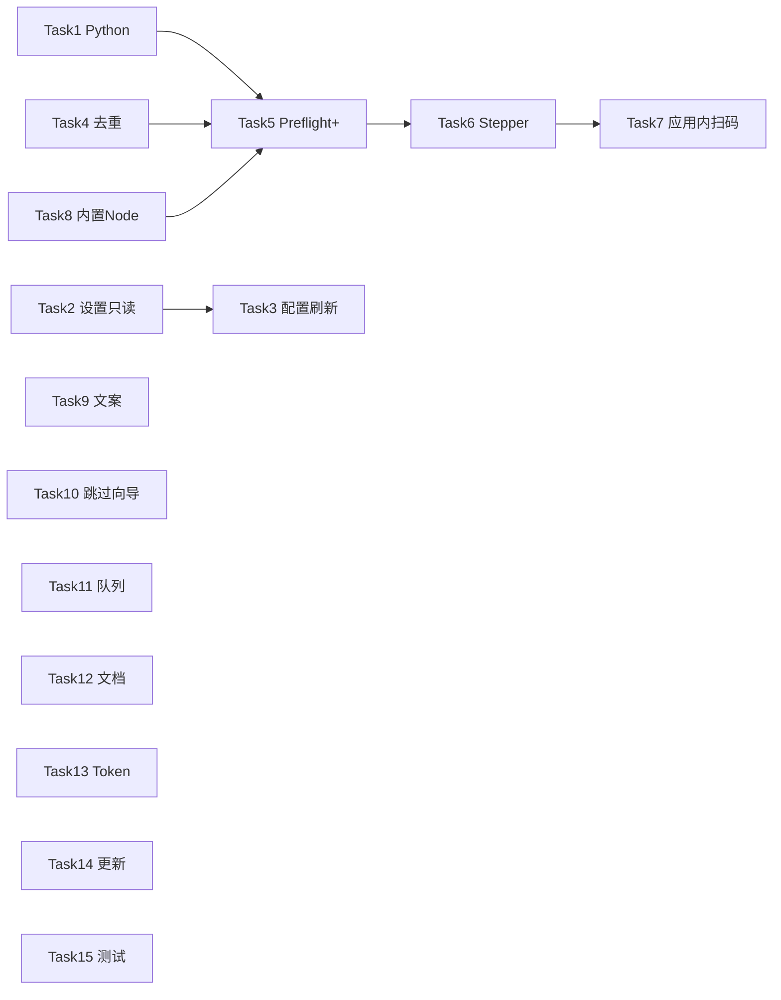

# wdbzk 运营版全面优化 Implementation Plan

> **For agentic workers:** REQUIRED SUB-SKILL: Use superpowers:subagent-driven-development (recommended) or superpowers:executing-plans to implement this plan task-by-task. Steps use checkbox (`- [ ]`) syntax for tracking.

**Goal:** 让 wdbzk 壁纸站运营者在「安装应用 → 首次设置 → 一键发布 → 日常批量运营」全链路中无需手填路径、少踩外部依赖坑，并降低重复入库与误配置风险。

**Architecture:** 延续「Electron 壳 + 内置工具目录（userData/tools）+ preflight 门禁」模型；新增 wallpaper 公开 API 去重层、发布队列调度器、凭证与 Node 运行时封装；UI 面向运营语义（wdbzk / B 站 CLI），高级路径只读。

**Tech Stack:** Electron 33, React 19, Zustand, electron-builder, bdpan CDN, bundled bilibili-cli + biliup, panapi.wdbzk.com, wallpaper.wdbzk.com public API, Vitest（新增）

**基线（已完成）：** 见 [`2026-06-26-wdbzk-operator-onboarding.md`](./2026-06-26-wdbzk-operator-onboarding.md)

**仓库：** https://github.com/webB1an/bilibili-auto-upload

---

## 阶段总览

| 阶段 | 周期 | 主题 | 交付标准 |
|------|------|------|----------|
| **Phase 1** | 第 1–2 周 | P0 能顺利用 | 无 Node/Python 路径误配；发布前可知是否重复；预检覆盖磁盘/源 |
| **Phase 2** | 第 2–3 周 | P1 体验 | 线性向导、应用内 B 站扫码、内置 Node、老用户免向导 |
| **Phase 3** | 第 3–4 周 | P2 运营效率 | 队列定时、文档、Token 安全、更新检查 |
| **Phase 4** | 并行 | 质量 | 核心模块单测 + CI typecheck |

---

## Phase 1 — P0（进行中）

- [x] Task 1: Python 检测与引导（`pythonRuntime.ts`、首次设置按钮）
- [x] Task 2: 设置页路径只读 + wdbzk 文案（`ReadOnlyPath`、高级折叠）
- [x] Task 3: 安装后配置自动刷新（`useConfigRefresh`）
- [x] Task 4: wallpaper.wdbzk.com 去重（`wallpaperCatalog.ts` + pipeline）
- [x] Task 5: 增强 preflight（磁盘、下载脚本、catalog）+ 发布页检查面板
- [x] Task 10: 老用户 preflight 全绿自动跳过首次设置

## Phase 2 — P1（待实施）

**Files:**
- Create: `app/electron/services/pythonRuntime.ts`
- Modify: `app/electron/services/preflight.ts`
- Modify: `app/electron/services/deps.ts`
- Modify: `app/src/pages/Onboarding.tsx`
- Modify: `app/electron/main.ts`, `app/electron/preload.ts`, `app/src/types/index.ts`

**行为：**
- `detectPython()`：`python --version`，解析 ≥3.10
- `ensurePythonRequests()` 从 `bilibiliRuntime.ts` 迁入或复用 `pythonRuntime.ts`
- 失败时返回 `{ ok: false, message, downloadUrl: 'https://www.python.org/downloads/' }`
- 首次设置 Step 1 增加「检测 Python」按钮 +「打开 Python 下载页」（`shell.openExternal`）
- preflight `python` 步骤：未安装 Python 时 **blocked**，不可完成向导

**验收：**
- [ ] 无 Python 时 preflight 明确提示，不进入发布
- [ ] 有 Python 无 requests 时自动 pip 成功或给出 pip 命令

---

### Task 2: 设置页路径只读 + wdbzk 文案

**Files:**
- Modify: `app/src/pages/Settings.tsx`
- Create: `app/src/components/ReadOnlyPath.tsx`
- Modify: `app/src/layouts/AppShell.tsx`（可选：设置子标题）

**行为：**
- `bdpan 命令路径` → 标签 **「bdpan 可执行文件（自动）」**，只读 + 「打开目录」
- `social-auto-upload 路径` → **「B 站 CLI 目录（自动）」**，只读
- 「pan-control」卡片标题 → **「wdbzk 资源库 API」**
- 高级折叠（默认收起）：允许手改路径的两项 Input，带警告文案

**验收：**
- [ ] 运营默认看不到可编辑路径
- [ ] 「打开目录」能打开 `%APPDATA%\Wallpaper Studio\tools\...`

---

### Task 3: 安装/登录后配置自动刷新

**Files:**
- Modify: `app/src/pages/Accounts.tsx`, `app/src/pages/Onboarding.tsx`
- Modify: `app/src/hooks/usePipeline.ts`（`useBootstrap` 抽出 `refreshConfig`）
- Create: `app/src/hooks/useConfigRefresh.ts`

**行为：**
- 封装 `refreshConfig()`：`configGet` → `setConfig`
- 以下操作完成后调用：`accountsBaiduInstall`、`accountsBilibiliInstall`、百度/B 站登录终端打开后用户点「检测状态」、`onboardingComplete`
- Settings 页 `useEffect` 监听 `config` 变化同步 `draft`

**验收：**
- [ ] 安装 bdpan 后不重启，设置页路径立即更新

---

### Task 4: wallpaper.wdbzk.com 发布前去重

**Files:**
- Create: `app/electron/services/wallpaperCatalog.ts`
- Modify: `app/electron/services/pipeline.ts`
- Modify: `app/electron/services/download.ts`（可选：下载前预检）
- Modify: `app/src/pages/Publish.tsx`
- Modify: `app/src/types/index.ts`

**API（已有）：**
```
GET https://wallpaper.wdbzk.com/api/wallpaper/resources?page=1&pageSize=50&keyword=
→ { code:200, data: { list: [{ id, name, link, click_count }], total } }
```

**行为：**
- `fetchWallpaperCatalog(keyword?: string)`：分页拉取 categoryId=61 列表（或 API 默认）
- `findDuplicateCandidate(title: string, shareLink?: string)`：
  - 归一化标题（去前缀、去 ` · ` 英文段、strip 动态壁纸后缀）与 `name` 模糊匹配
  - 若有 `shareLink`，与 `link` 子串比对
- `pipeline.ts` 在 `addHistoryRecord` 之前：
  - 若重复 → `progress('download','warning',...)` + 抛错或 **可配置** `skipDuplicate: true` 自动跳下一条（Settings 增加开关，默认 warn 并中止）
- Publish 页 preflight 扩展一步「资源库去重」：干跑时不下载，只报告「下一条将是 xxx，库内无重复」

**验收：**
- [ ] 库内已有同名资源时，日志明确提示并中止（或按配置跳过）
- [ ] 无网络时去重失败不阻塞发布（降级为 warning 日志）

---

### Task 5: 增强发布前预检（Preflight Plus）

**Files:**
- Modify: `app/electron/services/preflight.ts`
- Create: `app/electron/services/publishDryRun.ts`
- Modify: `app/electron/main.ts`（`preflight:run` 增加 `mode: 'full' | 'quick'`）
- Modify: `app/src/pages/Publish.tsx`, `app/src/pages/Dashboard.tsx`

**新增检查项：**

| id | 检查 |
|----|------|
| `disk` | userData + downloads 目录可用空间 ≥ 500MB |
| `fileLimit` | `maxFileSizeMb` 自洽 |
| `downloadSource` | 至少一个壁纸源脚本存在 |
| `nextItem` | dry-run：manifest/源首页是否可能有新条目（轻量：脚本 `--dry-run` 若支持，否则跳过） |
| `duplicate` | Task 4 去重干跑 |

**Publish 页：** 点击「开始发布」前自动 `preflightRun({ mode: 'full' })`，展示折叠面板「发布前检查」。

**验收：**
- [ ] 磁盘不足时按钮禁用并说明
- [ ] 全部通过才允许 `pipeline:run`

---

## Phase 2 — P1：体验与内置依赖

### Task 6: 首次设置改为线性 Stepper

**Files:**
- Create: `app/src/components/OnboardingStepper.tsx`
- Refactor: `app/src/pages/Onboarding.tsx`
- Modify: `app/src/store/appStore.ts`（可选：`onboardingStep: number`）

**步骤：**
1. 安装工具（bdpan + B 站 CLI + Python）
2. 登录账号（百度 + B 站）
3. wdbzk Token
4. 就绪确认（preflight 全绿 + 可选「测试连接」）

**行为：**
- 当前步骤未完成时，后续步骤灰色
- 完成后「完成设置，去发布」

**验收：**
- [ ] 新用户按 1→4 顺序操作，无歧义

---

### Task 7: B 站登录应用内二维码

**Files:**
- Modify: `app/electron/services/bilibili.ts`
- Create: `app/src/components/BilibiliLoginPanel.tsx`
- Modify: `app/src/pages/Onboarding.tsx`, `app/src/pages/Accounts.tsx`
- Modify: `app/electron/main.ts`（`accounts:bilibiliPollLogin` IPC）

**行为：**
- 「打开终端登录」保留；新增 **「应用内登录」**：
  1. spawn `python bili_cli.py login --account X`（detached，或改造 CLI 支持 `--qrcode-only` 输出路径）
  2. 轮询 `qrcode.png` _mtime / IPC 读文件
  3. UI 展示二维码图片 + 每 3s `accountsBilibiliCheck` 直到 valid
- 超时 3 分钟提示改用终端

**验收：**
- [ ] 不打开 cmd 也能扫码登录（Windows 优先）

---

### Task 8: 下载脚本使用内置 Node

**Files:**
- Create: `app/electron/services/nodeRuntime.ts`
- Modify: `app/electron/services/download.ts`
- Modify: `app/package.json`（评估是否打包 node binary 到 extraResources，或使用 `process.execPath` 的 node 子进程方案）

**方案 A（推荐）：** Electron 主进程用 `utilityProcess.fork()` 跑 download mjs（Node 20+）

**方案 B：** 打包 `node.exe` 到 `resources/node/`（+80MB，但更稳）

**行为：**
- `resolveNodeExecutable()`：packaged 用 bundled node，dev 用系统 `node`
- `download.ts` 的 `spawn` 改用解析结果
- preflight 移除对系统 Node 的硬性要求（或改为「内置 Node 就绪」）

**验收：**
- [ ] 运营机器未安装 Node.js 仍可下载壁纸

---

### Task 9: 文案与命名统一

**Files:**
- Modify: `app/src/pages/Settings.tsx`, `Accounts.tsx`, `Dashboard.tsx`, `Publish.tsx`, `Onboarding.tsx`
- Modify: `app/electron/services/deps.ts`（deps 标签）
- Modify: `README.md`, `docs/wdbzk-operator-guide.md`（Task 12）

**替换表：**

| 旧 | 新 |
|----|-----|
| pan-control | wdbzk 资源库 |
| social-auto-upload | B 站 CLI |
| 账号授权 | 账号与工具 |

**验收：**
- [ ] 界面无 `_research`、localhost pan-control 默认露出

---

### Task 10: 老用户自动跳过首次设置

**Files:**
- Modify: `app/electron/services/config.ts` 或 `app/electron/main.ts`（`app.whenReady`）
- Modify: `app/src/components/OnboardingGate.tsx`

**行为：**
- 启动时若 `!onboarding.completed` 且 `runPreflight(config).ready === true`：
  - 自动 `onboarding.completed = true` 并 save
  - 可选 toast：「检测到已完成配置，已跳过首次设置」
- 若 token 空但其余绿，仍进向导 Step 3

**验收：**
- [ ] 升级用户不被迫重走全流程

---

## Phase 3 — P2：运营效率与交付

### Task 11: 发布队列与定时

**Files:**
- Create: `app/electron/services/queue.ts`
- Modify: `app/electron/services/state.ts`（`queue: QueueJob[]`）
- Create: `app/src/pages/Queue.tsx`
- Modify: `app/src/App.tsx`, `app/src/layouts/AppShell.tsx`
- Modify: `app/electron/main.ts`（`queue:start`, `queue:stop`, `queue:status`）

**数据模型：**
```typescript
interface QueueSettings {
  enabled: boolean
  intervalMinutes: number  // 默认 30
  dailyLimit: number       // 默认 10
  stopOnError: boolean     // 默认 true
}
interface QueueState {
  running: boolean
  publishedToday: number
  lastRunAt?: string
  nextRunAt?: string
}
```

**行为：**
- 队列 tick：若 preflight ready 且未超 dailyLimit → `runPipeline`
- 成功后 `publishedToday++`，schedule 下次
- UI：队列开关、间隔、今日计数、暂停

**验收：**
- [ ] 开启队列后按间隔自动发布，达上限停止
- [ ] 失败按配置暂停并写日志

---

### Task 12: 运营一页纸文档

**Files:**
- Create: `docs/wdbzk-operator-guide.md`
- Modify: `README.md`
- Modify: `app/src/pages/Onboarding.tsx`（底部链接）

**章节：**
1. 安装 Wallpaper Studio
2. 百度开放平台 / bdpan 分享说明
3. B 站账号与分区 tid
4. wdbzk Token 与 categoryId 61
5. 首次发布检查清单
6. 常见错误对照表（Token 失效、文件过大、无新壁纸、重复入库）

**验收：**
- [ ] 运营无需读 README 开发章节即可上手

---

### Task 13: Token 安全存储

**Files:**
- Create: `app/electron/services/secrets.ts`
- Modify: `app/electron/services/config.ts`, `panControl.ts`, `preflight.ts`
- Modify: `app/src/pages/Settings.tsx`, `Onboarding.tsx`

**行为：**
- Windows：`safeStorage.encryptString` 存 `%APPDATA%/Wallpaper Studio/secrets.json`（仅 token）
- `config.json` 中 `apiToken` 存占位 `"__stored__"` 或空，读取时 merge
- 迁移：启动时若 config 有明文 token → 加密迁移并清空 config 字段

**验收：**
- [ ] 新保存后 config.json 无明文 token
- [ ] panapi 调用正常

---

### Task 14: 应用更新检查

**Files:**
- Create: `app/electron/services/updater.ts`
- Modify: `app/electron/main.ts`, `app/src/pages/Settings.tsx`
- Modify: `app/package.json`（`publish` 配置 + GitHub Releases）

**行为（轻量 v1）：**
- 启动 24h 内检查一次 `GET https://api.github.com/repos/webB1an/bilibili-auto-upload/releases/latest`
- 比较 `package.json version` vs tag
- 有新版本：设置页 banner + 「打开下载页」
- v2 再引入 `electron-updater` 自动下载

**验收：**
- [ ] 版本落后时运营能看到提示

---

## Phase 4 — 质量与 CI

### Task 15: 核心单测 + CI

**Files:**
- Create: `app/vitest.config.ts`
- Create: `app/electron/services/__tests__/title.test.ts`
- Create: `app/electron/services/__tests__/wallpaperCatalog.test.ts`
- Create: `app/electron/services/__tests__/preflight.test.ts`（mock fetch/spawn）
- Create: `.github/workflows/ci.yml`
- Modify: `app/package.json`（`"test": "vitest run"`）

**覆盖：**
- `buildTitle` 中文在前
- `extractChineseWallpaperName`
- 去重 normalize + match
- preflight step 聚合逻辑

**CI：**
```yaml
on: [push, pull_request]
jobs:
  check:
    runs-on: windows-latest
    steps:
      - uses: actions/checkout@v4
      - uses: actions/setup-node@v4
        with: { node-version: '20' }
      - run: cd app && npm ci && npm run typecheck && npm test
```

**验收：**
- [ ] PR 必过 typecheck + test

---

## 实施顺序（推荐）



**并行建议：**
- Week 1：Task 1 + 2 + 3 + 4（可两人并行 4 与 1）
- Week 2：Task 5 + 8 + 9 + 10
- Week 3：Task 6 + 7 + 12 + 15
- Week 4：Task 11 + 13 + 14

---

## 明确不做（本计划范围外）

- pan-control 自建部署文档与 UI
- 多租户 / 账号体系
- wallpaper 站后台 CMS 编辑
- 便携 Python 全量打包（仅检测+引导；全量打包体积过大单列调研）

---

## 每阶段完成定义（Definition of Done）

**Phase 1 Done：** 干净 Windows 10 虚拟机（仅装 Python）→ 首次设置 → 发布成功；重复资源被拦截；设置页路径只读。

**Phase 2 Done：** 同上虚拟机 **不装 Node.js** 仍可发布；B 站可在应用内扫码；老 config 自动跳过向导。

**Phase 3 Done：** 队列自动发 3 条间隔 5 分钟；Token 不在 config 明文；有 operator guide；GitHub Release 版本提示可见。

**Phase 4 Done：** CI 绿；title + dedup 有单测。

---

## 验证命令

```powershell
cd app
npm run typecheck
npm test
npm run dev
# 打包冒烟
npm run dist
```

---

## 变更记录

| 日期 | 说明 |
|------|------|
| 2026-06-26 | 初版：覆盖 P0–P2 全量优化项 |
